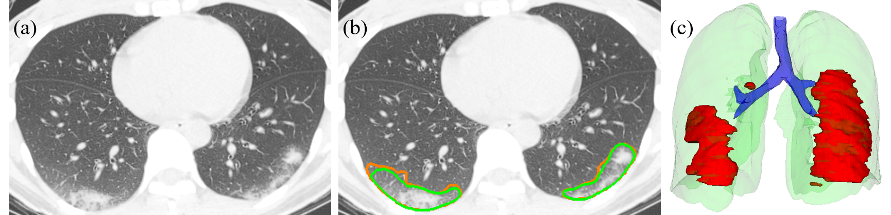
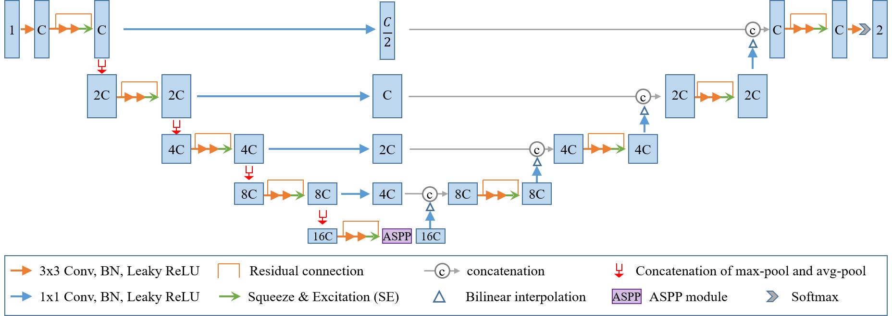

# COPLE-Net: COVID-19 Pneumonia Lesion segmentation network
This repository provides source code and pretrained model of COPLE-Net for COVID-19 pneumonia lesion segmentation proposed by G. Wang et al.[1]. If you use this code or the pretrained model, please cite the following paper:

* [1] G. Wang, X. Liu, C. Li, Z. Xu, J. Ruan, H. Zhu, T. Meng, K. Li, N. Huang, S. Zhang. 
[A Noise-robust Framework for Automatic Segmentation of COVID-19 Pneumonia Lesions from CT Images.][tmi2020] IEEE Transactions on Medical Imaging. 2020. DOI: [10.1109/TMI.2020.3000314][tmi2020]

A segmentation example. (a) one slice of a CT volume. (b) segmentation by COPLE-Net (green) compared with the ground truth (orange). (c) 3D visualization.

The structure of COPLE-Net. It employes a concatenation of max-pooling and average pooling to reduce information loss during down-sampling, and uses bridge layers to alleviate the semantic gap between features from the encoder and the decoder. ASPP block is used at the bottleneck to better deal with lesions at multiple scales.

# Dataset
Based on this project, we have also released a dataset named as `UESTC-COVID-19 Dataset`, which consists of 120 3D CT scans, where 70 volumes were annotated by non-experts and 50 volumes were annotated by experts. Click [here][data_link] to request for access. 

# Requirements
* [Pytorch][torch_link] version >=1.0.1.
* [PyMIC][pymic_link], a Pytorch-based toolkit for medical image computing. Version 0.2.3 is required. Install it by `pip install PYMIC==0.2.3`.
* Some basic python packages such as Numpy, Pandas, SimpleITK.

[data_link]:http://faculty.uestc.edu.cn/HiLab/en/article/379152/list/index.htm
[tmi2020]:https://ieeexplore.ieee.org/document/9109297
[torch_link]:https://pytorch.org
[pymic_link]:https://github.com/HiLab-git/PyMIC

# Third-party Implementations
COPLE-Net has also been implemented in [MONAI][monai_link], a PyTorch-based, open-source framework for deep learning in healthcare imaging. Thanks Dr. Wenqi Li for the re-implementation and you can find it [here][monai_cople].

[monai_link]:https://github.com/Project-MONAI/MONAI
[monai_cople]:https://monai.io/research/coplenet-pneumonia-lesion-segmentation

# How to use
1. Download the pretrained model and example CT images from [Google Drive][google_link] or [Baidu Netdisk][baidu_link] (extract code q0ci). Put them into the folder `coplenet_data`.
2. Run `python coplenet_run.py test config/config.cfg`. The results will be saved in `coplenet_data/result`.
3. To segment COVID-19 pneumonia lesions from your own images, make sure that the images have been cropped into the lung region, and the intensity has been normalized into [0, 1] using window width/level of 1500/-650. Open the configure file `config/config.cfg` and edit `root_dir`, `test_csv` and `output_dir` according to the path of your images. Then return to step 2 to obtain the segmentation results.

[google_link]:https://drive.google.com/drive/folders/1K1jbrxWWhG_L7dh6yMyB4DtklBr-bhxH?usp=sharing
[baidu_link]:https://pan.baidu.com/s/1TSTSkORYNWsX94PxiQUfjw 

